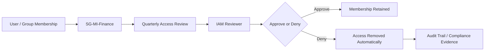
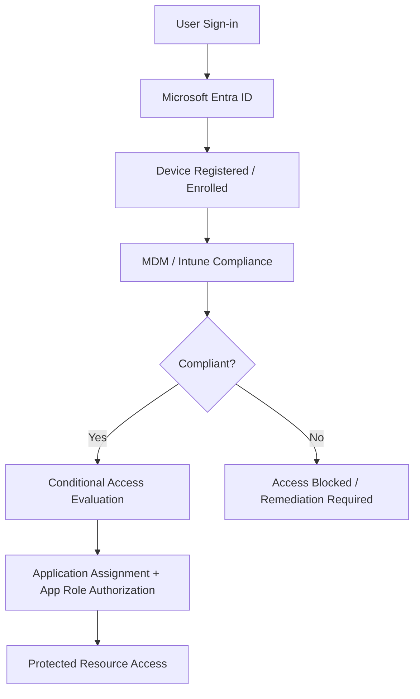
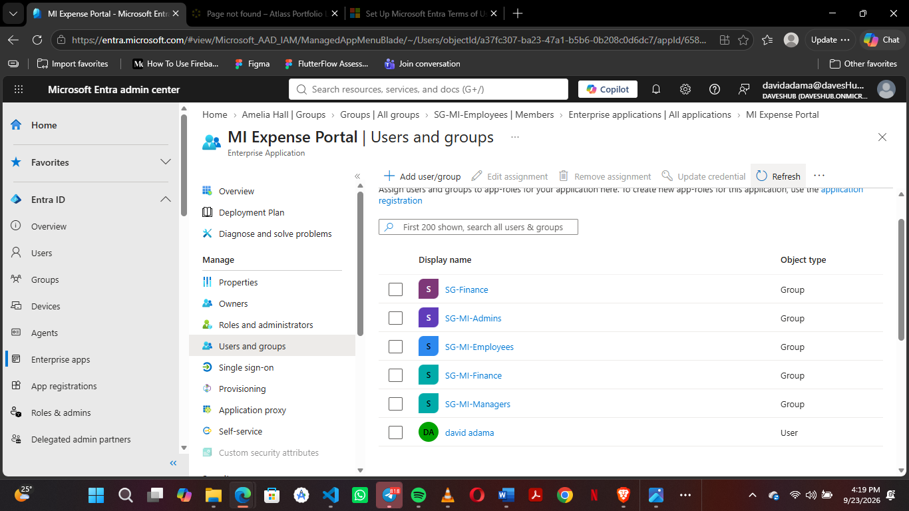

# Project 2 - Identity Federation & Zero Trust Platform


An enterprise identity and application-security project demonstrating how workforce identities in Microsoft Entra ID securely access internal and SaaS applications through federation, modern authentication, provisioning, and Zero Trust controls.

The project extends the identity lifecycle foundation established in Project 1 into the application and authentication layer. It is based on a fictional Mustard Innovations environment and focuses on secure application integration, least privilege, continuous verification, and auditable identity operations.

## Project Goals

- Integrate enterprise applications with Microsoft Entra ID.
- Implement SAML 2.0 federation for the MI Expense Portal.
- Implement OAuth 2.0 and OpenID Connect authentication patterns.
- Demonstrate SCIM-based application provisioning.
- Enforce application roles and least-privilege authorization.
- Apply MFA, Conditional Access, and identity risk controls.
- Monitor authentication, provisioning, and authorization activity.
- Automate identity infrastructure and configuration with Terraform.
- Integrate identity changes into CI/CD workflows.
- Document troubleshooting and security validation evidence.

## Business Scenario

Mustard Innovations is a fictional cloud-first enterprise with workforce identities managed in Microsoft Entra ID. Employees need access to several applications, but each application has different authentication, authorization, device, and risk requirements.

| Application | Integration | Security requirement |
| --- | --- | --- |
| MI HR Portal | OIDC | MFA |
| MI Expense Portal | SAML 2.0 | MFA and application RBAC |
| MI Engineering Portal | OIDC | Compliant device |
| MI SaaS Platform | SCIM | Automated provisioning |
| MI Admin Console | OIDC | Phishing-resistant MFA |
| External SaaS | SAML / Okta | Federated access |

## Security Principles

- **Zero Trust:** Verify explicitly, use least-privilege access, and assume breach.
- **Least privilege:** Authentication alone does not grant access to application resources.
- **Strong authentication:** Require MFA and stronger controls for sensitive applications.
- **Identity-centric security:** Use the identity, role, device, and risk context for access decisions.
- **Fail closed:** Missing or unrecognized role claims must not result in access.
- **Auditability:** Record authentication, provisioning, authorization, and administrative activity.
- **Infrastructure as Code:** Keep repeatable identity configuration and infrastructure in source control.

## 🔐 SAML Federation & Application RBAC

The MI Expense Portal implements enterprise identity federation using
Microsoft Entra ID and SAML 2.0.

### Authentication

- Microsoft Entra ID as Identity Provider
- SAML 2.0 federation
- Passport-SAML Service Provider
- SAML assertion validation
- Federated identity session management

### Authorization

- Microsoft Entra ID application roles
- Employee
- Manager
- Finance
- Admin
- Application-level RBAC middleware
- Least-privilege enforcement

### Validation

| Role | Employee Endpoint | Manager Endpoint | Finance Endpoint | Admin Endpoint |
|---|---:|---:|---:|---:|
| Employee | 200 ✅ | 403 ✅ | 403 ✅ | 403 ✅ |

The Employee test user can access only the Employee endpoint. Attempts to access Manager, Finance, or Admin resources return `HTTP 403 Forbidden`.

### Troubleshooting

During implementation I encountered and resolved:

- Missing SAML role claims
- Disabled application role selection
- Confusion between Entra directory roles and application roles
- Differences in SAML role attribute representation
- Separation of OAuth/OIDC and SAML authentication sessions

See the detailed documentation:

- [SAML Implementation](./documentation/authentication/SAML/01-SAML-Implementation.md)
- [Application RBAC](./documentation/authentication/SAML/02-Application-RBAC.md)
- [Troubleshooting](./documentation/authentication/SAML/03-Troubleshooting.md)
- [Testing & Validation](./documentation/authentication/SAML/04-Testing-and-Validation.md)
- [Security Architecture](./documentation/authentication/SAML/05-Security-Architecture.md)

## Authentication and Provisioning Models

### SAML 2.0

SAML is used for enterprise web application federation where Microsoft Entra ID acts as the Identity Provider and the application acts as the Service Provider. The application validates the returned assertion before creating an authenticated session.

### OAuth 2.0 and OpenID Connect

OAuth/OIDC is used for modern application authentication and delegated authorization. The project documents token handling, claims, callback flows, and the operational differences between OIDC sessions and SAML sessions.

### SCIM

SCIM supports automated user and group provisioning to connected applications. Provisioning workflows are designed to reduce manual access administration and support joiner, mover, and leaver processes.

## Zero Trust Controls

- Conditional Access policies for application access.
- MFA requirements based on application sensitivity and user context.
- Identity Protection and risk-based access decisions.
- Privileged Identity Management for administrative access.
- Access Reviews for periodic entitlement validation.
- Application roles for resource-level authorization.
- Monitoring of sign-in, provisioning, and audit events.

## Identity Governance and Entitlement Management

The project extends the identity foundation with governance controls designed to keep access aligned with business ownership and operational need over time. This includes explicit application ownership, group-based entitlement design, and periodic access reviews.

### Governance Model

The MI Expense Portal uses dedicated governing groups to separate identity entitlements from application authorization:

- `SG-MI-Employees` → Employee role
- `SG-MI-Managers` → Manager role
- `SG-MI-Finance` → Finance role
- `SG-MI-Admins` → Admin role

This model reduces direct assignment sprawl, creates a clearer entitlement boundary, and supports centralized review and remediation.

### Access Review Workflow



### Group-Based Governance Diagram


### Governance Implementation Highlights

- Enterprise application ownership is assigned to a named accountable owner.
- Assignment required is enabled for the application to enforce an explicit access boundary.
- Security groups drive access entitlement instead of direct per-user role assignment.
- Quarterly access reviews validate that membership still matches business need.
- Legacy entitlement cleanup is performed as part of access remediation and review cycles.

This governance pattern supports the overall Zero Trust model by ensuring access remains justified, reviewable, and controllable beyond initial onboarding.

## Zero Trust Device Compliance, MDM, and Device Governance

The platform also incorporates the device trust layer needed for Zero Trust enforcement. In this project, device posture is treated as a first-class condition for access, alongside identity authentication, application assignment, and role-based authorization.

### Device Trust Model

The current assessment found a tenant with a registered but unmanaged device and an expired Microsoft Entra ID P2 license, which means the project documents the intended Zero Trust design and governance model without claiming live production enforcement. The model is designed to integrate device compliance, endpoint management, and conditional access into the MI Expense Portal access path.




### Compliance Baseline

The project defines a proposed device compliance baseline for managed devices, including:

- Encryption enabled
- Secure boot enabled where supported
- Antivirus healthy and reporting
- Firewall enabled
- Supported operating system version
- Device enrollment and reporting in the endpoint-management platform

Devices that fail these checks are treated as noncompliant and subject to remediation before access is restored.

### MDM and Device Management Governance

The design emphasizes management ownership and operational governance for devices, including:

- Device registration and inventory review
- Endpoint management requirements
- Compliance assessment criteria
- Access restrictions for unmanaged or noncompliant devices
- Controlled exception handling for approved scenarios
- Continuous validation of device trust before protected-resource access

This aligns with Zero Trust principles by ensuring trust is not assumed solely from identity, but from the security posture of the device and the management status of the endpoint.

### Current Operational Status

The repository documents the current state and the constraints clearly:

- One Entra-registered device exists in the tenant.
- The device is currently unmanaged.
- The Microsoft Entra ID P2 trial has expired.
- Conditional Access enforcement remains pending licensing and management validation.
- No live enforcement claim is made without the required capabilities being operational.

This is an intentional governance approach: the documentation captures the model, constraints, and implementation path without overstating the current environment.

### Device Governance Evidence


These artifacts provide evidence for the device governance assessment, access-control design, and the operational safeguards that support a Zero Trust model.

## Repository Structure

```text
02-Identity-Federation-Zero-Trust/
├── applications/       Application registrations, enterprise apps, and service principals
├── automation/         PowerShell, configuration, logs, reports, and Terraform automation
├── ci-cd/               CI/CD workflows and GitHub Actions
├── diagrams/            Architecture diagrams and exports
├── documentation/       Requirements, implementation, authentication, and security docs
├── federation/         Identity providers and SAML/OAuth/OIDC federation material
├── infrastructure/      Terraform infrastructure definitions
├── monitoring/          Audit, sign-in, provisioning logs, and detections
├── provisioning/        SCIM provisioning configuration and documentation
├── screenshots/         Implementation and validation evidence
└── security/            Conditional Access and related security controls
```

## Architecture and Control Views

The project now includes architecture diagrams and control-flow views covering the core federation, authentication, provisioning, and governance patterns used across the platform.

### High-Level Platform Architecture


### Authentication, Provisioning, and Governance Flows


These views illustrate how Microsoft Entra ID, enterprise apps, federated identity flows, access reviews, and privileged access controls combine into a Zero Trust operating model.

## Validation Evidence

Validation covers both authentication and authorization:

1. Redirect the user to Microsoft Entra ID through the SAML login endpoint.
2. Receive the SAML response at the application callback endpoint.
3. Validate the assertion and inspect the role claim.
4. Create the federated application session.
5. Verify that the assigned application role controls endpoint access.
6. Confirm unauthorized requests return `403 Forbidden`.

Evidence should include enterprise application configuration, application role definitions, role assignment, successful authentication, received role claims, and endpoint responses. Secrets, private keys, tokens, and session cookies must never be included in screenshots or committed to source control.

### Implementation Evidence Gallery

The repository includes end-to-end screenshots showing the configuration and validation of the identity platform components. Example evidence includes:

#### SAML federation and RBAC validation


#### OAuth/OIDC and application authorization evidence


#### Identity governance and access review evidence



These screenshots provide evidence for the operational implementation and the security controls enforced by the platform.

## Related Documentation

- [Project Charter](./documentation/Project-Charter.md)
- [Business Requirements](./documentation/Business-Requirements.md)
- [Application Identity Foundation](./documentation/implementation/01-Application-Identity-Foundation.md)
- [OAuth/OIDC Implementation](./documentation/authentication/OAuth/oauth-oidc-implementation.md)
- [OAuth/OIDC Troubleshooting](./documentation/authentication/OAuth/troubleshooting.md)
- [Authorization Model](./documentation/application-authorization/Application-Authorization/authorization-model.md)
- [RBAC Implementation](./documentation/application-authorization/Application-Authorization/rbac-implementation.md)
- [Conditional Access Design](./documentation/security/Conditional-Access-Design.md)
- [Access Reviews](./documentation/security/Access-Review.md)
- [Entra ID Protection](./documentation/security/Entra-Id-Protection.md)
- [Privileged Identity Management](./documentation/security/Privileged-Identity-Management(PIM).md)

## Project Outcome

This project demonstrates an end-to-end identity federation capability: Microsoft Entra ID authenticates the workforce identity, the application validates the federation response, application roles determine authorization, and Zero Trust controls provide additional context and protection around access. The result is an auditable, least-privilege application integration model that can be extended to additional enterprise and SaaS applications.
