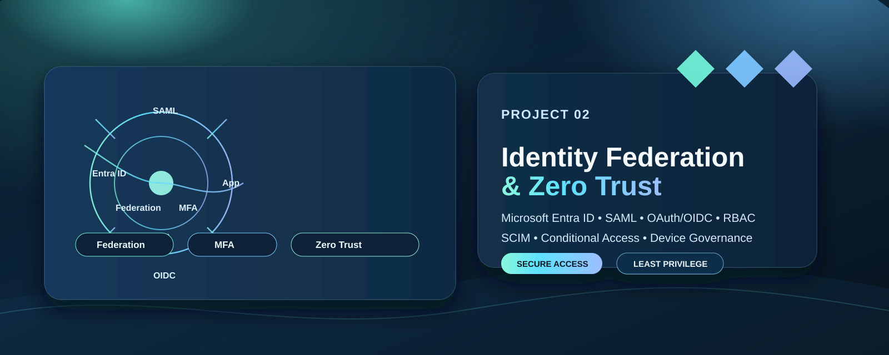
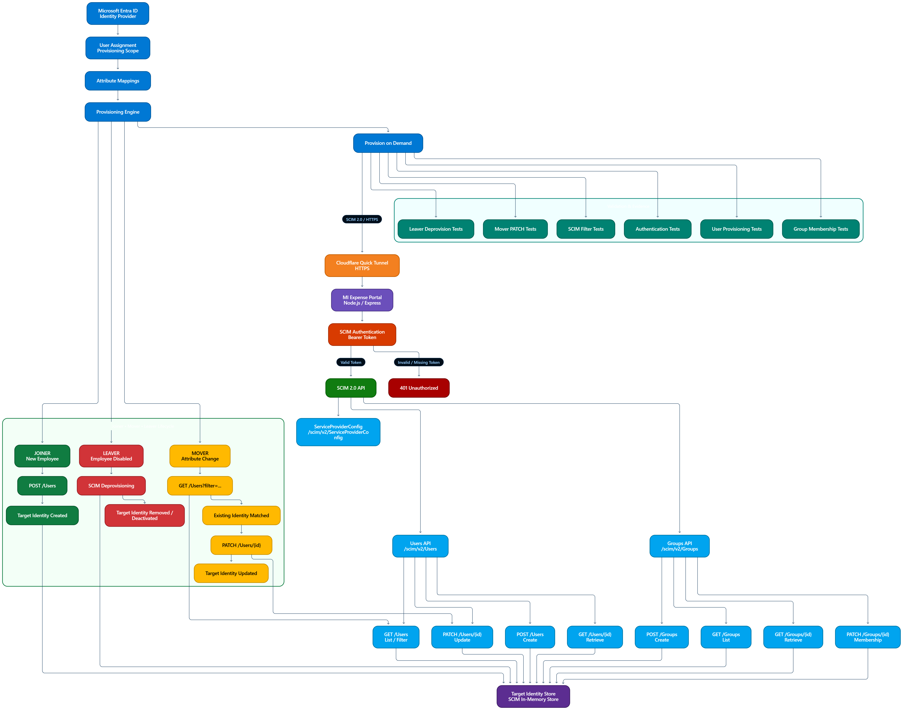
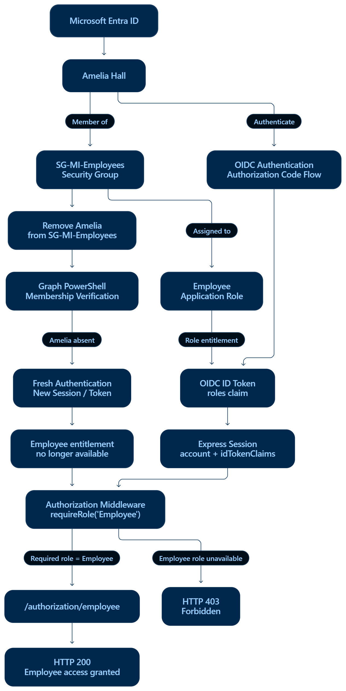

# Project 2 - Identity Federation & Zero Trust Platform



An enterprise identity and application-security project demonstrating how workforce identities in Microsoft Entra ID securely access internal and SaaS applications through federation, modern authentication, provisioning, and Zero Trust controls.

The project extends the identity lifecycle foundation established in Project 1 into the application and authentication layer. It is based on a fictional Mustard Innovations environment and focuses on secure application integration, least privilege, continuous verification, and auditable identity operations.

## Executive Summary

Project 2 delivers an enterprise identity federation and Zero Trust model for Mustard Innovations, built around Microsoft Entra ID as the control plane for authentication, authorization, provisioning, and governance. The design spans SAML, OAuth/OIDC, SCIM, RBAC, identity governance, and device-aware security decisions to show how access is granted, enforced, and reviewed at scale.

This project is centered on the MI Expense Portal and demonstrates how application roles, assignment logic, access reviews, and device trust combine to support least privilege and clear auditability.

## What I Built

### Portfolio summary

- Microsoft Entra ID as the federated identity provider
- SAML-based enterprise access using app roles and claims
- OAuth/OIDC implementation for modern delegated authentication
- SCIM-based lifecycle provisioning for users and groups
- Application-layer RBAC with fail-closed authorization behavior
- Access governance, PIM alignment, and Zero Trust device compliance design

### Business flow

1. Workforce users authenticate through Microsoft Entra ID
2. The application receives identity context and claims
3. Assignment and app role determine authorization
4. The app enforces access boundaries at runtime
5. Governance and review controls maintain accountability over time

## Architecture


## Core Capabilities

### OIDC
- Modern delegated authentication
- Claims-based authorization decisions
- Secure integration patterns for enterprise apps


### SAML
- External identity federation for app access
- Assertion validation and role mapping
- Permission enforcement using explicit app claims


### SCIM
- Automated user and group lifecycle provisioning
- Reduced manual access maintenance
- Joiner, mover, and leaver alignment



### RBAC
- Explicit app assignment model
- Role-based authorization enforced at the app layer
- Fail-closed behavior for missing or invalid claims


### Governance
- Group-based entitlements and access reviews
- Ownership and accountability at the application layer
- Lifecycle governance for access decisions



### PIM
- Privileged access governance model
- Least-privilege controls for administrative access


### Zero Trust
- Device trust, compliance, and MDM alignment
- Conditional Access-driven verification
- Exception handling with governance and visibility


## Security Decisions

Key design principles behind the implementation:

- **Least privilege:** Access is granted only through explicit entitlement paths
- **Fail closed:** Missing or unknown role claims do not authorize access
- **Strong identity assurance:** MFA and identity risk controls are part of the model
- **Explicit assignments:** Access is controlled rather than assumed by default
- **Governed exceptions:** Device and access exceptions are documented and reviewed
- **Auditability:** Identity decisions are designed to be explainable and traceable

## Validation & Evidence

The implementation includes validation for both authentication and authorization:

- Entra app registration and configuration evidence
- SAML assertion and role claim validation
- Successful authentication and denied access responses
- RBAC endpoint validation showing `200` and `403` behavior
- Governance and access review evidence
- Device trust and conditional access assessment artifacts

Example evidence:


## 8. Repository Structure

```text
02-Identity-Federation-Zero-Trust/
├── applications/       Application registrations, enterprise apps, and service principals
├── automation/         PowerShell, configuration, logs, reports, and Terraform automation
├── ci-cd/               CI/CD workflows and GitHub Actions
├── diagrams/            Architecture diagrams and exports
├── documentation/       Requirements, implementation, authentication, and security docs
├── federation/         Identity providers and SAML/OAuth/OIDC federation material
├── infrastructure/      Terraform infrastructure definitions
├── monitoring/          Audit, sign-in, provisioning logs, and detections
├── provisioning/        SCIM provisioning configuration and documentation
├── screenshots/         Implementation and validation evidence
└── security/            Conditional Access and related security controls
```

## 9. Detailed Documentation

This README is intentionally kept to a concise portfolio format. The deeper implementation detail, troubleshooting, and validation notes remain in the dedicated documentation files.

### Architecture and technical references

- [Project Charter](./documentation/Project-Charter.md)
- [Business Requirements](./documentation/Business-Requirements.md)
- [Application Identity Foundation](./documentation/implementation/01-Application-Identity-Foundation.md)
- [OAuth/OIDC Implementation](./documentation/authentication/OAuth/oauth-oidc-implementation.md)
- [SAML Implementation](./documentation/authentication/SAML/01-SAML-Implementation.md)
- [Application RBAC](./documentation/authentication/SAML/02-Application-RBAC.md)
- [Access Reviews](./documentation/security/Access-Review.md)
- [Conditional Access Design](./documentation/security/Conditional-Access-Design.md)
- [Enterprise Application Governance](./documentation/identity%20governance/enterprise-application-governance.md)
- [Privileged Identity Management](./documentation/security/Privileged-Identity-Management(PIM).md)

### Supporting architecture views


## 10. Project Outcome

This project demonstrates an end-to-end identity federation and Zero Trust capability: Microsoft Entra ID authenticates the workforce identity, the application validates the federation response, application roles determine authorization, and governance and device-aware controls add additional protection around access. The result is a well-governed, least-privilege application integration model that can be extended to additional enterprise and SaaS applications.
